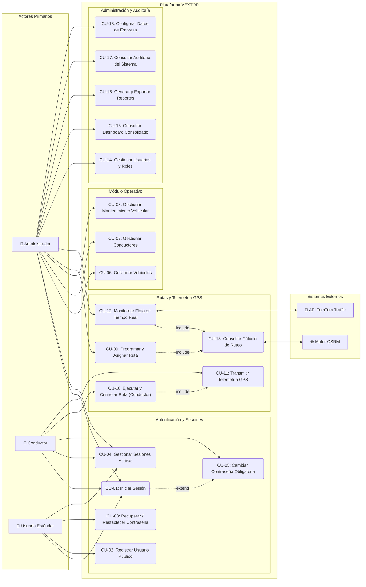
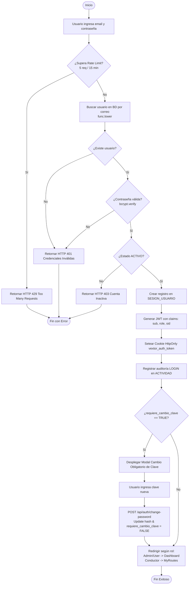
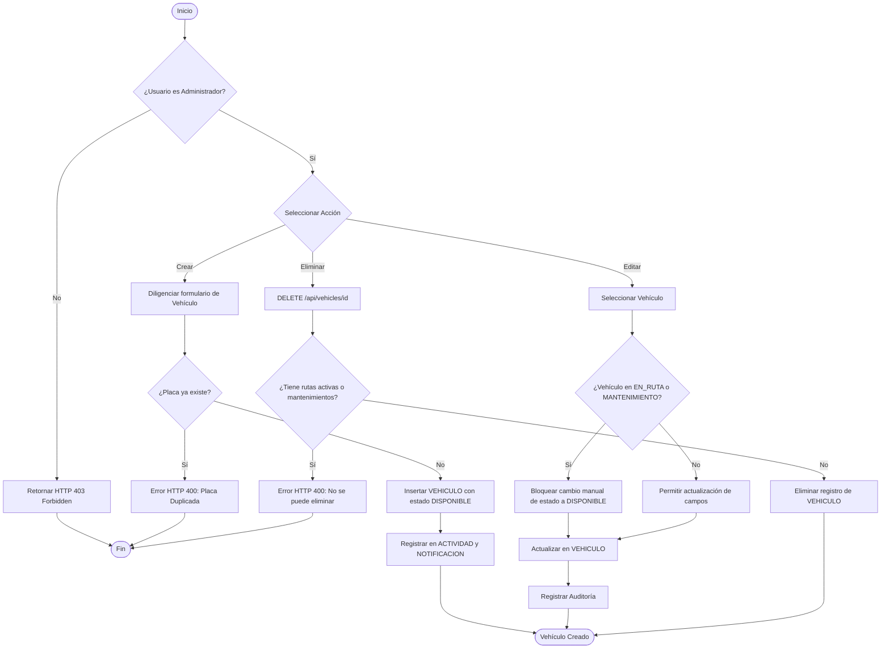
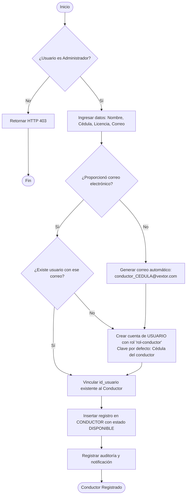
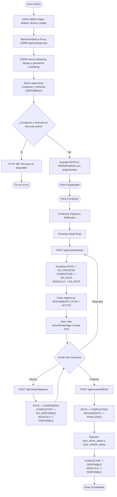
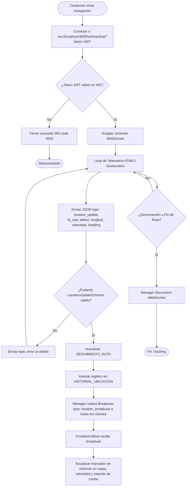
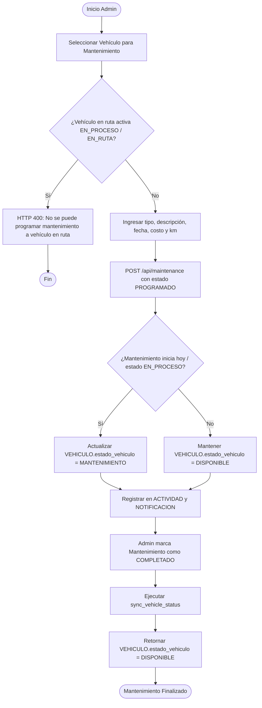
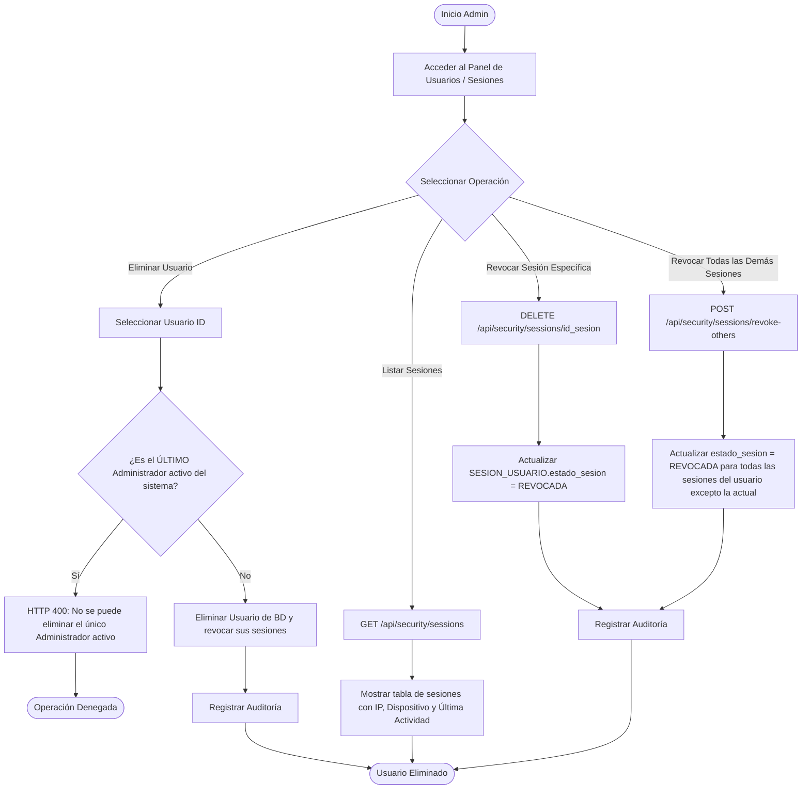
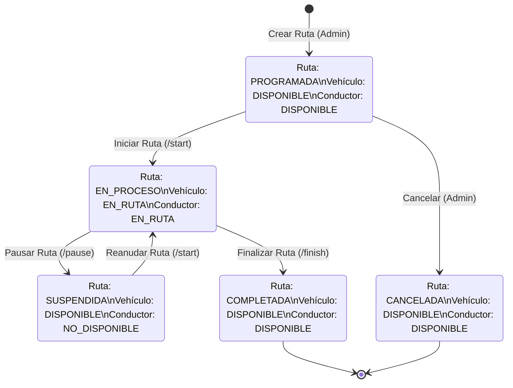

# Documentación Funcional y Análisis de Sistema — VEXTOR

**Proyecto:** VEXTOR — Sistema Inteligente de Gestión de Flotas y Monitoreo Vehicular
**Versión del Documento:** 1.0.0
**Fecha de Análisis:** Estado Actual del Código Fuente
**Estado:** Basado Exclusivamente en la Implementación Real del Código Fuente

---

## 1. INTRODUCCIÓN Y ALCANCE DEL SISTEMA

### 1.1 Introducción
VEXTOR es una plataforma integral para la gestión operativa, control y seguimiento geográfico en tiempo real de flotas vehiculares y rutas de transporte. La plataforma permite coordinar conductores, vehículos, mantenimientos preventivos y correctivos, programación y ejecución de rutas con telemetría GPS, e inspección auditable de la actividad operativa.

El presente documento constituye la **documentación funcional oficial de VEXTOR**, elaborada mediante un análisis riguroso de extremo a extremo (*end-to-end*) sobre el código fuente del proyecto (frontend React 19, backend FastAPI Python 3.12, base de datos PostgreSQL/Supabase, motor de ruteo OSRM y WebSocket Server). Cada caso de uso, flujo de actividad, regla de negocio y restricción documentada corresponde estrictamente a la implementación ejecutable del sistema.

### 1.2 Alcance del Sistema Implementado
El sistema abarca los siguientes submódulos funcionales totalmente operativos:

1. **Gestión de Autenticación y Control de Sesiones:**
   - Registro público de usuarios (asignación automática del rol 'Usuario').
   - Autenticación mediante credenciales con contraseñas encriptadas mediante bcrypt.
   - Emisión de Tokens JWT almacenados en Cookies HttpOnly `vextor_auth_token` o cabecera `Authorization: Bearer`.
   - Control estricto de sesiones activas concurrentes en base de datos (`SESION_USUARIO`), con revocado individual o masivo (*Revoke All Other Sessions*).
   - Rate Limiting en endpoints sensibles (5 peticiones por ventana de 15 minutos).
   - Proceso de recuperación de contraseña con token temporal SHA-256 expirante y notificación por correo.
   - Forzado de cambio de contraseña obligatoria (`requiere_cambio_clave = TRUE`) al iniciar sesión.

2. **Gestión de Usuarios y Control de Acceso Basado en Roles (RBAC):**
   - Gestión administrativa de usuarios con asignación de roles.
   - Protección de la cuenta del último Administrador activo del sistema (imposibilidad de desactivación, cambio de rol o eliminación).

3. **Gestión de Vehículos y Hoja de Vida Operativa:**
   - Registro, edición, listado paginado y eliminación de vehículos.
   - Control de kilometraje acumulado e inspección del límite de mantenimiento.
   - Sincronización automática del estado operativo del vehículo (`DISPONIBLE`, `EN_RUTA`, `MANTENIMIENTO`, `INACTIVO`).

4. **Gestión de Conductores:**
   - Registro y vinculación bidireccional entre la entidad Conductor y la cuenta de Usuario.
   - Auto-provisión de registros de conductor para usuarios creados con el rol Conductor.
   - Sincronización automática del estado del conductor (`DISPONIBLE`, `EN_RUTA`, `NO_DISPONIBLE`, `INACTIVO`, `SUSPENDIDO`).

5. **Programación y Asignación de Rutas:**
   - Registro de rutas con origen y destino geográfico, fecha/hora programada y código único.
   - Asignación obligatoria de un conductor disponible y un vehículo disponible.
   - Validación de disponibilidad que bloquea la asignación repetida de conductores o vehículos con rutas activas.
   - Proxy OSRM para el cálculo de distancia, duración y trazado geométrico de la ruta sobre mapas Leaflet.

6. **Navegación y Ejecución de Ruta por el Conductor:**
   - Módulo especializado para conductores (`/driver/my-routes` y `/driver/active-route`).
   - Transiciones de estado de ruta: `PROGRAMADA` $\rightarrow$ `EN_PROCESO` / `EN_RUTA` $\rightarrow$ `SUSPENDIDA` $\rightarrow$ `COMPLETADA` / `CANCELADA`.
   - Transmisión en tiempo real de datos de telemetría GPS (latitud, longitud, velocidad, rumbo/heading) mediante WebSockets (`/ws/tracking`) con fallback HTTP POST (`/api/routes/{id}/location`).
   - HUD (Heads-Up Display) de navegación con cálculo de velocidad instantánea en km/h e instrucciones de giros paso a paso.

7. **Centro de Control y Tracking en Tiempo Real para Administradores:**
   - Vista integrada "Conductores en Ruta" con marcadores dinámicos rotados según el ángulo GPS (heading).
   - Capa de tráfico en tiempo real mediante integración con la API de TomTom Traffic.
   - Alerta visual de desactualización de señal GPS cuando transcurren más de 45 segundos sin reportar (*is_stale*).

8. **Gestión de Mantenimiento Vehicular:**
   - Registro de mantenimientos preventivos y correctivos vinculados a un vehículo.
   - Transición automática del estado del vehículo a `MANTENIMIENTO` durante ejecuciones activas.
   - Retorno automático a `DISPONIBLE` tras finalizar o eliminar el mantenimiento.

9. **Centro de Reportes y Exportación:**
   - Consulta de datos consolidados del sistema con filtrado por módulo, fechas y términos.
   - Exportación nativa a formatos binarios PDF, CSV y Excel XLSX procesados en el backend.
   - Trazabilidad de descargas mediante log de auditoría.

10. **Auditoría, Notificaciones y Configuración de Empresa:**
    - Registro automático e inalterable de auditoría (`ACTIVIDAD`) para operaciones de mutación (creación, edición, eliminación), inicios de sesión, cierres de sesión y reseteos.
    - Sistema de notificaciones en tiempo real persistido en BD con panel deslizable (portal React).
    - Configuración de datos institucionales de la empresa (`EMPRESA`) y parametrización de días de retención.

---

## 2. ACTORES DEL SISTEMA Y MATRIZ RBAC

### 2.1 Identificación de Actores Reales
Del análisis del código backend (`vextor_be/app/api/routes/crud.py`, `auth.py`, `driver_routes.py`) y frontend (`vextor_fe/src/routes/AppRoutes.jsx`), se identifican los siguientes **4 actores del sistema**:

1. **Administrador (`Rol: Administrador` - UUID: `11111111-2222-3333-4444-555555555551`):**
   - **Descripción:** Usuario con privilegios totales sobre la plataforma.
   - **Permisos:** Gestión de usuarios, vehículos, conductores, rutas, mantenimientos, auditoría, sesiones activas, reportes y configuración de empresa.
   - **Restricciones:** No puede eliminar, desactivar ni cambiar el rol a sí mismo si es el último administrador activo del sistema.

2. **Conductor (`Rol: Conductor` - UUID: `11111111-2222-3333-4444-555555555552`):**
   - **Descripción:** Personal operativo encargado de la conducción de los vehículos y ejecución de las rutas asignadas.
   - **Permisos:** Consultar sus rutas asignadas (`/driver/my-routes`), iniciar/pausar/finalizar sus rutas activas (`/driver/active-route`), transmitir su posición GPS en tiempo real por WebSockets u HTTP, actualizar su perfil y contraseña.
   - **Restricciones:** No tiene acceso a paneles administrativos, gestión de otros usuarios, vehículos, mantenimientos ni configuración global. No puede modificar rutas que no le pertenezcan.

3. **Usuario (`Rol: Usuario` - UUID: `11111111-2222-3333-4444-555555555555`):**
   - **Descripción:** Usuario estándar registrado públicamente en la plataforma.
   - **Permisos:** Consultar información general permitida (dashboard básico, consulta de rutas/vehículos en modo lectura), actualizar su perfil y administrar sus propias sesiones.
   - **Restricciones:** No puede realizar operaciones de escritura en ningún módulo administrativo (bloqueado por middleware `require_admin`).

4. **Sistemas Externos / APIs (Actor Secundario / Sistema):**
   - **Engine de Ruteo OSRM:** Provee el cálculo de itinerario, coordenadas de polígonos e instrucciones giro a giro.
   - **TomTom Traffic API:** Provee teselas raster en tiempo real para la capa de flujo vehicular.
   - **OpenStreetMap / Nominatim:** Provee el geocodificado directo e inverso y mapas base.

### 2.2 Matriz de Permisos por Endpoint (RBAC Real)

| Módulo / Endpoint | Método HTTP | Administrador | Conductor | Usuario | Autenticación Requerida |
| :--- | :---: | :---: | :---: | :---: | :---: |
| `/api/auth/register` | POST | Sí | Sí | Sí | Pública (Rate Limited) |
| `/api/auth/login` | POST | Sí | Sí | Sí | Pública (Rate Limited) |
| `/api/auth/forgot-password` | POST | Sí | Sí | Sí | Pública (Rate Limited) |
| `/api/auth/profile` | PUT | Sí | Sí | Sí | Requerida |
| `/api/auth/me` | GET | Sí | Sí | Sí | Requerida |
| `/api/users` | GET / DELETE | **Sí** | No (403) | No (403) | Requerida (`require_admin`) |
| `/api/vehicles` | GET | Sí | Sí | Sí | Requerida |
| `/api/vehicles` | POST / PUT / DELETE | **Sí** | No (403) | No (403) | Requerida (`require_admin`) |
| `/api/drivers` | GET | Sí | Sí | Sí | Requerida |
| `/api/drivers` | POST / PUT / DELETE | **Sí** | No (403) | No (403) | Requerida (`require_admin`) |
| `/api/routes` | GET | Sí | Sí | Sí | Requerida |
| `/api/routes` | POST / DELETE | **Sí** | No (403) | No (403) | Requerida (`require_admin`) |
| `/api/routes/{id}` | PUT | **Sí** | Solo asignado | No (403) | Requerida |
| `/api/routes/driver/my-routes` | GET | Sí | **Sí** | Sí | Requerida |
| `/api/routes/{id}/start|pause|finish` | POST | **Sí** | Solo asignado | No (403) | Requerida |
| `/api/routes/{id}/location` | POST | **Sí** | Solo asignado | No (403) | Requerida |
| `/api/routes/active-tracking` | GET | Sí | Sí | Sí | Requerida |
| `/ws/tracking` | WS | **Sí** | **Sí** | **Sí** | Requerida (Token Query/Header) |
| `/api/maintenance` | GET | Sí | Sí | Sí | Requerida |
| `/api/maintenance` | POST / PUT / DELETE | **Sí** | No (403) | No (403) | Requerida (`require_admin`) |
| `/api/activities` | GET | **Sí** | No (403) | No (403) | Requerida (`require_admin`) |
| `/api/reports/export` | GET / POST | **Sí** | No (403) | No (403) | Requerida (`require_admin`) |
| `/api/company` | GET | Sí | Sí | Sí | Requerida |
| `/api/company` | POST / PUT / DELETE | **Sí** | No (403) | No (403) | Requerida (`require_admin`) |

---

## 3. DIAGRAMA GENERAL DE CASOS DE USO

A continuación se presenta el Diagrama UML General de Casos de Uso del sistema VEXTOR en formato Mermaid:

---

## 4. DESCRIPCIÓN DETALLADA DE CASOS DE USO

### 4.1 Tabla Resumen de Casos de Uso

| ID | Caso de Uso | Actor Principal | Objetivo | Precondiciones | Resultado |
| :--- | :--- | :--- | :--- | :--- | :--- |
| **CU-01** | Iniciar Sesión | Usuario / Conductor / Admin | Autenticar credenciales y obtener JWT + sesión activa en BD. | Cuenta registrada en sistema. | Token emitido en Cookie HttpOnly, sesión creada en `SESION_USUARIO`. |
| **CU-02** | Registrar Usuario | Usuario Público | Crear una cuenta pública con rol 'Usuario'. | Correo no registrado previamente. | Registro insertado en `USUARIO` con rol 'Usuario' y hash bcrypt. |
| **CU-03** | Restablecer Contraseña | Usuario | Solicitar y cambiar contraseña mediante token temporal. | Usuario existente con correo registrado. | Token SHA-256 generado, email enviado y clave actualizada. |
| **CU-04** | Gestionar Sesiones | Usuario / Admin | Visualizar y revocar sesiones activas concurrentes. | Usuario con sesión activa iniciada. | Sesión(es) marcadas como `REVOCADA` en BD. |
| **CU-05** | Cambiar Clave Obligatoria| Conductor / Usuario | Actualizar clave cuando `requiere_cambio_clave = TRUE`. | Iniciar sesión con indicador de cambio forzado. | Clave actualizada, flag removido y acceso habilitado. |
| **CU-06** | Gestionar Vehículos | Administrador | Registrar, actualizar, listar y eliminar vehículos. | Rol de Administrador autenticado. | Registro actualizado en `VEHICULO` y auditoría registrada. |
| **CU-07** | Gestionar Conductores | Administrador | Registrar y gestionar hoja de vida de conductores. | Rol de Administrador autenticado. | Registro en `CONDUCTOR` y vinculación a `USUARIO`. |
| **CU-08** | Gestionar Mantenimiento | Administrador | Programar y ejecutar mantenimientos vehiculares. | Vehículo registrado en la plataforma. | Registro en `MANTENIMIENTO` y estado de vehículo actualizado. |
| **CU-09** | Programar y Asignar Ruta | Administrador | Definir ruta, trayecto OSRM y asignar conductor/vehículo. | Conductor y Vehículo en estado `DISPONIBLE`. | Registro en `RUTA` y asignaciones activas en BD. |
| **CU-10** | Ejecutar Ruta | Conductor | Iniciar, pausar y finalizar rutas asignadas. | Ruta en estado `PROGRAMADA` y asignada al conductor. | Transición de estado de ruta, vehículo y conductor en BD. |
| **CU-11** | Transmitir Telemetría | Conductor / Sistema | Transmitir coordenadas GPS, velocidad y heading. | Ruta en estado `EN_PROCESO` o `EN_RUTA`. | Registro en `SEGUIMIENTO_RUTA` e `HISTORIAL_UBICACION`. |
| **CU-12** | Monitorear Flota | Administrador | Visualizar ubicación en tiempo real y capa de tráfico. | Sesión de Administrador activa. | Renderizado de mapa interactivo con marcadores y alertas. |
| **CU-13** | Consultar Ruteo OSRM | Administrador / Sistema | Calcular distancia, duración y trazado entre puntos. | Servidor OSRM disponible en backend. | Objeto JSON con geometría LineString e instrucciones. |
| **CU-14** | Gestionar Usuarios | Administrador | Crear, listar, editar y eliminar cuentas de usuario. | Rol de Administrador autenticado. | Mantenimiento de cuentas en `USUARIO` respetando RBAC. |
| **CU-15** | Consultar Dashboard | Administrador | Visualizar indicadores clave de rendimiento (KPIs). | Sesión activa en plataforma. | Métricas consolidadas de flota, rutas y mantenimiento. |
| **CU-16** | Generar Reportes | Administrador | Consultar y exportar datos a PDF, CSV y Excel. | Rol de Administrador autenticado. | Archivo binario descargado y log de auditoría registrado. |
| **CU-17** | Consultar Auditoría | Administrador | Inspeccionar trazabilidad inalterable de operaciones. | Rol de Administrador autenticado. | Listado de actividades filtrado por módulo, fecha o usuario. |
| **CU-18** | Configurar Empresa | Administrador | Actualizar datos institucionales y retención de datos. | Rol de Administrador autenticado. | Registro actualizado en tabla `EMPRESA`. |

---

### 4.2 Fichas de Casos de Uso Clave

#### CU-01 — Iniciar Sesión
- **Actor principal:** Usuario, Conductor, Administrador.
- **Objetivo:** Autenticarse en el sistema mediante correo y contraseña para obtener acceso a la plataforma.
- **Precondiciones:** La cuenta debe existir y estar activa en la base de datos.
- **Postcondiciones:** Se crea una entrada en `SESION_USUARIO`, se emite una Cookie HttpOnly `vextor_auth_token` y se retorna el perfil del usuario.
- **Flujo Principal:**
  1. El usuario ingresa correo y contraseña en el formulario de login.
  2. El frontend realiza la petición POST a `/api/auth/login`.
  3. El backend verifica la tasa de peticiones mediante `InMemoryRateLimiter` (máximo 5 intentos por IP en 15 min).
  4. El backend busca la cuenta mediante correo insensible a mayúsculas/minúsculas (`func.lower(correo_usuario)`).
  5. El backend valida el hash bcrypt de la contraseña.
  6. Se verifica que el usuario esté en estado `ACTIVO`.
  7. Se registra una nueva sesión en `SESION_USUARIO` almacenando IP, agente de usuario y timestamp.
  8. Se genera un Token JWT firmado que incluye `sub`, `role` y `sid` (ID de sesión).
  9. Se establece la cookie HttpOnly `vextor_auth_token` y se registra la actividad en `ACTIVIDAD`.
  10. El frontend redirige al usuario según su rol (Administrador/Usuario al Dashboard, Conductor a `/driver/my-routes`).
- **Flujos Alternativos:**
  - *A1. Credenciales inválidas:* Se retorna HTTP 401 y se incrementa el contador del Rate Limiter.
  - *A2. Usuario Inactivo:* Se retorna HTTP 403 notificando la suspensión de la cuenta.
  - *A3. Cambio obligatorio de clave:* Si `requiere_cambio_clave = TRUE`, se retorna el flag `must_change_password: true`, desplegando el modal `ForcedPasswordModal` sin otorgar acceso completo hasta que la contraseña sea actualizada.
- **Reglas de negocio relacionadas:** RN-001, RN-002, RN-003, RN-004, RN-005, RN-006.

#### CU-06 — Gestionar Vehículos
- **Actor principal:** Administrador.
- **Objetivo:** Registrar, modificar, listar y eliminar vehículos de la flota operada por VEXTOR.
- **Precondiciones:** El usuario debe poseer rol de Administrador.
- **Postcondiciones:** Los datos del vehículo se persisten en la tabla `VEHICULO` y se registra auditoría.
- **Flujo Principal:**
  1. El Administrador accede al módulo de Vehículos (`/vehicles`).
  2. El frontend invoca `GET /api/vehicles` con paginación.
  3. Para crear un vehículo, se hace clic en "Nuevo Vehículo" y se diligencia el formulario (placa, marca, modelo, año, tipo, capacidad, kilometraje actual, límite de mantenimiento).
  4. El frontend envía POST a `/api/vehicles`.
  5. El backend valida que la placa sea única (UniqueConstraint) y los campos obligatorios.
  6. Se asigna el estado inicial `DISPONIBLE` y se inserta en `VEHICULO`.
  7. Se registra auditoría en `ACTIVIDAD` y se genera una notificación en `NOTIFICACION`.
- **Flujos Alternativos:**
  - *A1. Placa duplicada:* Se retorna HTTP 400 por violación de clave única.
  - *A2. Edición:* Permite modificar datos básicos. Si el vehículo está en estado `EN_RUTA` o `MANTENIMIENTO`, el backend bloquea la modificación manual del estado a `DISPONIBLE` para prevenir inconsistencias operativas.
  - *A3. Eliminación:* Se elimina el vehículo únicamente si no posee rutas activas o mantenimientos en progreso.
- **Reglas de negocio relacionadas:** RN-009, RN-010.

#### CU-09 — Programar y Asignar Ruta
- **Actor principal:** Administrador.
- **Actores secundarios:** Motor OSRM.
- **Objetivo:** Crear una nueva ruta de transporte definiendo origen, destino, horario programado, conductor y vehículo asignados.
- **Precondiciones:** Debe existir al menos un conductor y un vehículo en estado `DISPONIBLE`.
- **Postcondiciones:** La ruta se registra en `RUTA` con estado `PROGRAMADA` y se crean las relaciones en `ASIGNACION_CONDUCTOR` y `ASIGNACION_VEHICULO`.
- **Flujo Principal:**
  1. El Administrador navega al módulo de Rutas (`/routes`) y selecciona "Nueva Ruta".
  2. Ingresa código de ruta, nombre, origen, destino y fecha/hora programada.
  3. El frontend consulta el endpoint proxy `/api/routing/route` para calcular el trazado geométrico, distancia en km y tiempo estimado mediante OSRM.
  4. El Administrador selecciona un Conductor de la lista de conductores disponibles.
  5. El Administrador selecciona un Vehículo de la lista de vehículos disponibles.
  6. El Administrador guarda la ruta (POST `/api/routes`).
  7. El backend en `RouteService` valida que ni el conductor ni el vehículo estén actualmente asignados a una ruta en estado `EN_PROCESO`, `EN_RUTA` o `SUSPENDIDA`.
  8. Se crea la ruta con `estado_ruta = 'PROGRAMADA'` y sus respectivas asignaciones activas.
  9. Se genera auditoría y notificación.
- **Flujos Alternativos:**
  - *A1. Conductor o vehículo no disponible:* El backend rechaza la creación retornando HTTP 400 indicando la colisión de asignación.
- **Reglas de negocio relacionadas:** RN-013, RN-014.

#### CU-10 — Ejecutar y Controlar Ruta (Conductor)
- **Actor principal:** Conductor.
- **Objetivo:** Iniciar, pausar y finalizar una ruta de transporte asignada en tiempo real.
- **Precondiciones:** La ruta debe estar asignada al conductor logueado y estar en estado `PROGRAMADA`, `EN_PROCESO` o `SUSPENDIDA`.
- **Postcondiciones:** Actualización coordinada de estados de Ruta, Conductor y Vehículo en la base de datos.
- **Flujo Principal:**
  1. El Conductor ingresa a su panel `/driver/my-routes` y visualiza sus rutas asignadas.
  2. Selecciona la ruta y presiona "Iniciar Ruta" (POST `/api/routes/{id}/start`).
  3. El backend actualiza `RUTA.estado_ruta = 'EN_PROCESO'`, asigna `hora_inicio_real = ahora`, y cambia `CONDUCTOR.estado_conductor = 'EN_RUTA'` y `VEHICULO.estado_vehiculo = 'EN_RUTA'`.
  4. Se crea un registro inicial en `SEGUIMIENTO_RUTA` con estado `ACTIVO`.
  5. El frontend redirige a la vista de navegación `/driver/active-route/{id}` e inicia el envío automático de coordenadas GPS por WebSocket.
  6. Durante el trayecto, el conductor puede presionar "Pausar Ruta" (POST `/api/routes/{id}/pause`), lo que cambia `RUTA.estado_ruta = 'SUSPENDIDA'` y `CONDUCTOR.estado_conductor = 'NO_DISPONIBLE'`.
  7. Al llegar al destino, el conductor presiona "Finalizar Ruta" (POST `/api/routes/{id}/finish`).
  8. El backend registra `RUTA.estado_ruta = 'COMPLETADA'`, `hora_fin_real = ahora`, y ejecuta `sync_driver_status` y `sync_vehicle_status` para retornar a Conductor y Vehículo al estado `DISPONIBLE`.
- **Flujos Alternativos:**
  - *A1. Intento de inicio por usuario no asignado:* El backend retorna HTTP 403 Forbidden.
  - *A2. Intento de re-iniciar ruta completada:* El backend retorna HTTP 400 Bad Request.
- **Reglas de negocio relacionadas:** RN-012, RN-014.

---

## 5. DIAGRAMAS DE ACTIVIDADES DE LOS PROCESOS PRINCIPALES

### A. Proceso de Autenticación y Control de Acceso

---

### B. Proceso de Gestión de Vehículos

---

### C. Proceso de Gestión de Conductores

---

### D. Proceso de Gestión y Ejecución de Rutas

---

### E. Proceso de Seguimiento y Telemetría en Tiempo Real (WebSocket)

---

### F. Proceso de Mantenimiento Vehicular

---

### G. Proceso de Administración de Usuarios, Sesiones y Revocación

---

## 6. REGLAS DE NEGOCIO

### 6.1 Módulo: Autenticación y Seguridad

#### RN-001 — Asignación Exclusiva de Rol en Registro Público
- **Módulo:** Autenticación
- **Descripción:** Todo registro público a través del endpoint `/api/auth/register` asigna obligatoriamente el rol `Usuario` (UUID `11111111-2222-3333-4444-555555555555`).
- **Condición:** Solicitud enviada al endpoint público de registro.
- **Comportamiento esperado:** El backend ignora cualquier parámetro de rol enviado en el payload cliente y fuerza la asociación con el UUID del rol `Usuario`.
- **Entidades involucradas:** `USUARIO`, `ROL`.
- **Implementación encontrada:** `app/services/auth_service.py` en `register_user()`.

#### RN-002 — Búsqueda de Correo Insensible a Mayúsculas/Minúsculas
- **Módulo:** Autenticación
- **Descripción:** Las consultas de autenticación y verificación de correo electrónico se evalúan de forma insensible a mayúsculas y minúsculas (*case-insensitive*).
- **Condición:** Búsqueda de usuario por correo en login, registro o recuperación de clave.
- **Comportamiento esperado:** La consulta SQL utiliza `func.lower(Usuario.correo_usuario) == email_clean` garantizando coincidencia sin importar la capitalización.
- **Entidades involucradas:** `USUARIO`.
- **Implementación encontrada:** `app/services/auth_service.py` y `app/api/routes/auth.py`.

#### RN-003 — Rate Limiting en Autenticación
- **Módulo:** Seguridad
- **Descripción:** Los endpoints sensibles de autenticación (`/login`, `/register`, `/forgot-password`) están restringidos a un máximo de 5 peticiones por dirección IP en una ventana móvil de 15 minutos.
- **Condición:** Peticiones HTTP consecutivas desde una misma IP de origen.
- **Comportamiento esperado:** Si se excede el límite, el servidor retorna HTTP 429 Too Many Requests.
- **Entidades involucradas:** `InMemoryRateLimiter`.
- **Implementación encontrada:** `app/core/rate_limiter.py` e invocación en `app/api/routes/auth.py`.

#### RN-004 — Persistencia y Validación de Sesiones Activas
- **Módulo:** Seguridad y Sesiones
- **Descripción:** Cada inicio de sesión exitoso crea un registro en `SESION_USUARIO`. El token JWT incluye el claim `sid` (ID de sesión). Cada petición valida que la sesión correspondiente exista en la BD y tenga `estado_sesion = 'ACTIVA'`.
- **Condición:** Presentación de Token JWT en solicitudes autenticadas.
- **Comportamiento esperado:** Si la sesión fue revocada en BD, el servidor rechaza el acceso con HTTP 401 Unauthorized, invocando `delete_cookie`.
- **Entidades involucradas:** `SESION_USUARIO`, `USUARIO`.
- **Implementación encontrada:** `app/services/auth_service.py` (`get_current_user`, `login_user`, `logout_user`).

#### RN-005 — Mitigación de Enumeración en Recuperación de Contraseña
- **Módulo:** Autenticación
- **Descripción:** El endpoint de solicitud de recuperación de contraseña `/api/auth/forgot-password` retorna siempre la misma respuesta genérica, independientemente de si el correo existe o no en la base de datos.
- **Condición:** Solicitud de reseteo de clave.
- **Comportamiento esperado:** Retornar mensaje estandarizado sin revelar la existencia de la cuenta.
- **Entidades involucradas:** `USUARIO`.
- **Implementación encontrada:** `app/api/routes/auth.py` (`forgot_password`).

#### RN-006 — Cambio Obligatorio de Contraseña
- **Módulo:** Seguridad
- **Descripción:** Si la columna `requiere_cambio_clave` en `USUARIO` está en `TRUE`, la respuesta de inicio de sesión retorna `must_change_password: true`, forzando la actualización de clave mediante `POST /api/auth/change-password` antes de otorgar acceso al Dashboard.
- **Condición:** Iniciar sesión con indicador `requiere_cambio_clave = TRUE`.
- **Comportamiento esperado:** Despliegue de modal de cambio obligatorio en el frontend.
- **Entidades involucradas:** `USUARIO`.
- **Implementación encontrada:** `app/services/auth_service.py` y `vextor_fe/src/components/ui/ForcedPasswordModal.jsx`.

---

### 6.2 Módulo: Usuarios y Roles

#### RN-007 — Protección del Último Administrador Activo
- **Módulo:** Usuarios
- **Descripción:** El sistema impide la eliminación, desactivación o cambio de rol del único Administrador activo registrado en la plataforma.
- **Condición:** Intento de eliminación (`DELETE /api/users/{id}`), desactivación o actualización de rol del último usuario con rol `Administrador` y estado `ACTIVO`.
- **Comportamiento esperado:** El backend arroja una excepción HTTP 400 Bad Request bloqueando la operación.
- **Entidades involucradas:** `USUARIO`, `ROL`.
- **Implementación encontrada:** `app/services/crud_services.py` en `UserService.delete()` y `UserService.update()`.

#### RN-008 — Restricción de Modificación de Datos de Empresa
- **Módulo:** Empresa / Administración
- **Descripción:** Únicamente los usuarios con el rol `Administrador` pueden crear, actualizar o eliminar la configuración institucional de la empresa (`/api/company`).
- **Condición:** Invocación de métodos PUT/POST/DELETE en `/api/company`.
- **Comportamiento esperado:** Invocación de la dependencia `require_admin`. Los usuarios no administradores reciben HTTP 403.
- **Entidades involucradas:** `EMPRESA`, `ROL`.
- **Implementación encontrada:** `app/api/routes/crud.py` en `company_router`.

---

### 6.3 Módulo: Vehículos

#### RN-009 — Unicidad de Placa Vehicular
- **Módulo:** Vehículos
- **Descripción:** Toda placa vehicular registrada en el sistema debe ser única.
- **Condición:** Intento de registro o actualización de un vehículo con una placa ya existente.
- **Comportamiento esperado:** Restricción a nivel de base de datos (`UniqueConstraint('placa')`) y captura en backend retornando HTTP 400.
- **Entidades involucradas:** `VEHICULO`.
- **Implementación encontrada:** `vextor_bd/vextor_bd.sql` y `app/services/crud_services.py`.

#### RN-010 — Bloqueo de Modificación Manual de Estado en Vehículos Asignados
- **Módulo:** Vehículos
- **Descripción:** Un vehículo que se encuentre asignado a una ruta activa (`EN_PROCESO`, `EN_RUTA`) o a un mantenimiento activo (`EN_PROCESO`) no puede cambiar su estado manualmente a `DISPONIBLE` mediante la interfaz de edición.
- **Condición:** Intento de cambiar `estado_vehiculo` a `DISPONIBLE` durante una asignación activa.
- **Comportamiento esperado:** El backend rechaza la actualización con HTTP 400. El estado solo se restablece automáticamente al finalizar la ruta o el mantenimiento.
- **Entidades involucradas:** `VEHICULO`, `RUTA`, `MANTENIMIENTO`.
- **Implementación encontrada:** `app/services/crud_services.py` en `sync_vehicle_status()`.

---

### 6.4 Módulo: Conductores

#### RN-011 — Auto-Provisión y Vinculación de Registro de Conductor
- **Módulo:** Conductores
- **Descripción:** Cuando un usuario posee el rol `Conductor` pero no tiene una entrada en la tabla `CONDUCTOR`, el servicio `DriverService.get_all()` o el creador de conductores genera/vincula automáticamente el registro de conductor derivando credenciales e información base.
- **Condición:** Usuario con rol `Conductor` sin registro equivalente en `CONDUCTOR`.
- **Comportamiento esperado:** Generación e inserción automática del registro en `CONDUCTOR` asociado al `id_usuario`.
- **Entidades involucradas:** `CONDUCTOR`, `USUARIO`, `ROL`.
- **Implementación encontrada:** `app/services/crud_services.py` (`DriverService.get_all()`) y `app/api/routes/crud.py`.

#### RN-012 — Sincronización Automática de Estado del Conductor
- **Módulo:** Conductores
- **Descripción:** El estado operativo del conductor (`DISPONIBLE`, `EN_RUTA`, `NO_DISPONIBLE`) se gestiona automáticamente en función de sus asignaciones de ruta activas.
- **Condición:** Inicio, pausa o finalización de ruta.
- **Comportamiento esperado:**
  - Al iniciar ruta: `estado_conductor = 'EN_RUTA'`.
  - Al pausar ruta: `estado_conductor = 'NO_DISPONIBLE'`.
  - Al finalizar ruta: `estado_conductor = 'DISPONIBLE'` (si no tiene otra ruta activa).
- **Entidades involucradas:** `CONDUCTOR`, `RUTA`, `ASIGNACION_CONDUCTOR`.
- **Implementación encontrada:** `app/services/crud_services.py` (`sync_driver_status()`) y `app/api/routes/driver_routes.py`.

---

### 6.5 Módulo: Rutas y Telemetría GPS

#### RN-013 — Exclusión Mutua en Asignación de Conductores y Vehículos
- **Módulo:** Rutas
- **Descripción:** No se puede asignar un conductor o vehículo a una nueva ruta si actualmente se encuentra vinculado a una ruta activa (`EN_PROCESO`, `EN_RUTA` o `SUSPENDIDA`).
- **Condición:** Creación o actualización de ruta con asignación de conductor/vehículo.
- **Comportamiento esperado:** Backend verifica activamente en `RouteService` y retorna HTTP 400 impidiendo la doble asignación.
- **Entidades involucradas:** `RUTA`, `ASIGNACION_CONDUCTOR`, `ASIGNACION_VEHICULO`.
- **Implementación encontrada:** `app/services/crud_services.py` en `RouteService.create()` y `update()`.

#### RN-014 — Máquina de Estados Finita para Rutas
- **Módulo:** Rutas
- **Descripción:** El estado de una ruta sigue una transición estricta:
  - `PROGRAMADA` $\rightarrow$ `EN_PROCESO`
  - `EN_PROCESO` $\leftrightarrow$ `SUSPENDIDA`
  - `EN_PROCESO` $\rightarrow$ `COMPLETADA`
  - `PROGRAMADA` / `EN_PROCESO` $\rightarrow$ `CANCELADA`
- **Condición:** Solicitud de cambio de estado.
- **Comportamiento esperado:** Intentar transiciones inválidas (ej. de `COMPLETADA` a `EN_PROCESO`) genera error HTTP 400.
- **Entidades involucradas:** `RUTA`.
- **Implementación encontrada:** `app/api/routes/driver_routes.py`.

#### RN-015 — Validación de Coordenadas GPS en Telemetría WebSocket
- **Módulo:** Tracking
- **Descripción:** Los paquetes de actualización de ubicación enviados por WebSocket son validados mediante Pydantic (`LocationUpdateSchema`).
- **Condición:** Mensaje `location_update` recibido en `/ws/tracking`.
- **Comportamiento esperado:** Valida rangos geométricos: `latitud` $\in [-90, 90]$, `longitud` $\in [-180, 180]$, `velocidad` $\ge 0$, `heading` $\in [0, 360]$. En caso de invalidez, descarta la actualización y emite mensaje de error al cliente.
- **Entidades involucradas:** `SeguimientoRuta`, `HistorialUbicacion`.
- **Implementación encontrada:** `app/websocket/tracking.py`.

#### RN-016 — Umbral de Desactualización de Señal GPS (Stale Warning)
- **Módulo:** Tracking / Frontend
- **Descripción:** En la vista de monitoreo de flota en tiempo real, si transcurren más de 45 segundos sin recibir actualizaciones de ubicación de un vehículo en ruta activa, se activa el indicador `is_stale = true` mostrando una advertencia de señal GPS perdida.
- **Condición:** `(ahora - ultima_actualizacion) > 45 segundos`.
- **Comportamiento esperado:** Cálculo en backend (`GET /api/routes/active-tracking`) y renderizado con alerta visual en frontend.
- **Entidades involucradas:** `SeguimientoRuta`.
- **Implementación encontrada:** `app/api/routes/driver_routes.py` y `vextor_fe/src/pages/Routes/Routes.jsx`.

---

## 7. REGLAS DE ESTADOS Y TRANSICIONES

### 7.1 Matriz de Transiciones de Estados

| Entidad | Estado Actual | Acción / Evento | Nuevo Estado | Condición / Restricción |
| :--- | :--- | :--- | :--- | :--- |
| **Ruta** | `PROGRAMADA` | Iniciar Ruta (`POST /start`) | `EN_PROCESO` | Conductor asignado inicia la ruta. |
| **Ruta** | `EN_PROCESO` | Pausar Ruta (`POST /pause`) | `SUSPENDIDA` | Conductor suspende temporalmente. |
| **Ruta** | `SUSPENDIDA` | Reanudar Ruta (`POST /start`) | `EN_PROCESO` | Conductor reanuda la marcha. |
| **Ruta** | `EN_PROCESO` | Finalizar Ruta (`POST /finish`)| `COMPLETADA` | Conductor llega a destino. |
| **Ruta** | `PROGRAMADA` / `EN_PROCESO` | Cancelar Ruta (Admin) | `CANCELADA` | Administrador cancela la ruta. |
| **Vehículo** | `DISPONIBLE` | Asignar a Ruta / Iniciar Ruta | `EN_RUTA` | Ruta pasa a `EN_PROCESO`. |
| **Vehículo** | `EN_RUTA` | Finalizar Ruta | `DISPONIBLE` | Transición automática vía `sync_vehicle_status`. |
| **Vehículo** | `DISPONIBLE` | Registrar Mantenimiento Activo | `MANTENIMIENTO` | Mantenimiento en fecha / `EN_PROCESO`. |
| **Vehículo** | `MANTENIMIENTO` | Finalizar Mantenimiento | `DISPONIBLE` | Mantenimiento pasa a `COMPLETADO`. |
| **Conductor**| `DISPONIBLE` | Iniciar Ruta | `EN_RUTA` | Conductor inicia la marcha. |
| **Conductor**| `EN_RUTA` | Pausar Ruta | `NO_DISPONIBLE` | Conductor suspende su marcha. |
| **Conductor**| `EN_RUTA` / `NO_DISPONIBLE` | Finalizar Ruta | `DISPONIBLE` | Vía `sync_driver_status`. |
| **Usuario**  | `ACTIVO` | Desactivar Cuenta (Admin) | `INACTIVO` | Cuenta suspendida. Acceso bloqueado. |

---

### 7.2 Diagrama UML de Estados Coordinados (Ruta - Vehículo - Conductor)

---

## 8. SEGURIDAD Y RBAC

1. **Autenticación con JWT y Cookies HttpOnly:**
   - La sesión del cliente se autentica mediante tokens JWT firmados con algoritmo HS256 empleando la clave `JWT_SECRET_KEY`.
   - El token se transmite primariamente en Cookies `HttpOnly` (`vextor_auth_token`) con flag `samesite=lax` y `secure` parametrizable (`SECURE_COOKIE`), previniendo ataques XSS. Secundariamente admite cabecera `Authorization: Bearer <token>`.

2. **Control de Sesiones Concurrentes y Revocación Persistente:**
   - El token JWT almacena un ID de sesión único (`sid`).
   - Cada solicitud valida en tiempo real la tabla `SESION_USUARIO` en PostgreSQL. Si la sesión tiene `estado_sesion != 'ACTIVA'`, el acceso es denegado inmediatamente.

3. **Rate Limiting (Control de Tasa):**
   - Implementado mediante `InMemoryRateLimiter` en los endpoints de autenticación (`/register`, `/login`, `/forgot-password`), limitando a 5 solicitudes por cada 15 minutos por IP para prevenir ataques de fuerza bruta.

4. **Middleware de Cabeceras HTTP de Seguridad:**
   - Registrado en FastAPI (`app/main.py`):
     - `X-Content-Type-Options: nosniff`
     - `X-Frame-Options: DENY`
     - `X-XSS-Protection: 1; mode=block`
     - `Strict-Transport-Security: max-age=31536000; includeSubDomains`
     - `Referrer-Policy: strict-origin-when-cross-origin`

5. **Aislamiento de Módulos por Roles:**
   - La dependencia `require_admin` intercepta las llamadas a endpoints de mutación administrativa y rechaza con HTTP 403 Forbidden a cualquier usuario sin el rol `Administrador`.

---

## 9. BASE DE DATOS Y RESTRICCIONES

El esquema de base de datos relacional PostgreSQL / Supabase está definido en `vextor_bd/vextor_bd.sql`.

### 9.1 Entidades Principales y Llaves
- **`ROL`**: `id_rol` (UUID, PK), `nombre_rol` (VARCHAR(50), UNIQUE).
- **`USUARIO`**: `id_usuario` (UUID, PK), `id_rol` (FK a ROL), `correo_usuario` (VARCHAR(150), UNIQUE), `contrasenia_usuario` (VARCHAR(255)), `requiere_cambio_clave` (BOOLEAN DEFAULT FALSE).
- **`SESION_USUARIO`**: `id_sesion` (UUID, PK), `id_usuario` (FK a USUARIO), `estado_sesion` (VARCHAR(20) DEFAULT 'ACTIVA').
- **`CONDUCTOR`**: `id_conductor` (UUID, PK), `id_usuario` (FK a USUARIO), `cedula_conductor` (VARCHAR(20), UNIQUE), `licencia` (VARCHAR(50)), `estado_conductor` (VARCHAR(20)).
- **`VEHICULO`**: `id_vehiculo` (UUID, PK), `placa` (VARCHAR(15), UNIQUE), `kilometraje_actual` (INT), `estado_vehiculo` (VARCHAR(20)).
- **`RUTA`**: `id_ruta` (UUID, PK), `codigo_ruta` (VARCHAR(50), UNIQUE), `estado_ruta` (VARCHAR(30)).
- **`ASIGNACION_CONDUCTOR`**: `id_asignacion` (UUID, PK), `id_ruta` (FK a RUTA), `id_conductor` (FK a CONDUCTOR).
- **`ASIGNACION_VEHICULO`**: `id_asignacion` (UUID, PK), `id_ruta` (FK a RUTA), `id_vehiculo` (FK a VEHICULO).
- **`SEGUIMIENTO_RUTA`**: `id_seguimiento` (UUID, PK), `id_ruta` (FK a RUTA), `latitud` (FLOAT), `longitud` (FLOAT), `velocidad` (FLOAT), `heading` (FLOAT).
- **`HISTORIAL_UBICACION`**: `id_historial` (UUID, PK), `id_seguimiento` (FK a SEGUIMIENTO_RUTA), `latitud` (FLOAT), `longitud` (FLOAT).
- **`MANTENIMIENTO`**: `id_mantenimiento` (UUID, PK), `id_vehiculo` (FK a VEHICULO), `estado_mantenimiento` (VARCHAR(20)).
- **`ACTIVIDAD`**: `id_actividad` (UUID, PK), `id_usuario` (FK a USUARIO), `tipo_accion`, `modulo`, `fecha_hora`.
- **`NOTIFICACION`**: `id_notificacion` (UUID, PK), `id_usuario` (FK a USUARIO), `leido` (BOOLEAN DEFAULT FALSE).
- **`EMPRESA`**: `id_empresa` (UUID, PK), `nit` (VARCHAR(50), UNIQUE).

### 9.2 Restricciones (Constraints) e Índices
- **Check Constraints:** Validaciones de formato y valores positivos en montos, capacidades y kilometrajes.
- **Unique Constraints:** Placa en `VEHICULO`, Cédula en `CONDUCTOR`, Correo en `USUARIO`, NIT en `EMPRESA`, Código en `RUTA`.
- **Índices de Rendimiento:** Creados en llaves foráneas (`idx_usuario_rol`, `idx_conductor_usuario`, `idx_seguimiento_ruta`, `idx_actividad_usuario`) para acelerar búsquedas y JOINs.
- **Ausencia de Triggers Nativos SQL:** El script `vextor_bd.sql` no define triggers nativos `CREATE TRIGGER`. Toda la lógica de sincronización de estados, auditoría y alertas se ejecuta a nivel de aplicación en el backend FastAPI (`crud_services.py`, `driver_routes.py`, `AuditService`).

---

## 10. MATRIZ DE TRAZABILIDAD

| Regla de Negocio | Caso de Uso | Módulo | Entidad(es) Involucrada(s) | Implementación en Código Fuente |
| :--- | :--- | :--- | :--- | :--- |
| **RN-001** (Rol Usuario en Registro) | CU-02 | Autenticación | `USUARIO`, `ROL` | `vextor_be/app/services/auth_service.py` (`register_user`) |
| **RN-002** (Email Case-Insensitive) | CU-01, CU-02, CU-03 | Autenticación | `USUARIO` | `vextor_be/app/services/auth_service.py` (`func.lower`) |
| **RN-003** (Rate Limiting) | CU-01, CU-02, CU-03 | Seguridad | `InMemoryRateLimiter` | `vextor_be/app/core/rate_limiter.py` & `routes/auth.py` |
| **RN-004** (Validación de Sesión) | CU-01, CU-04 | Seguridad | `SESION_USUARIO` | `vextor_be/app/services/auth_service.py` (`get_current_user`) |
| **RN-005** (No Enumeración de Email)| CU-03 | Autenticación | `USUARIO` | `vextor_be/app/api/routes/auth.py` (`forgot_password`) |
| **RN-006** (Clave Obligatoria) | CU-01, CU-05 | Seguridad | `USUARIO` | `auth_service.py` & `ForcedPasswordModal.jsx` |
| **RN-007** (Proteger Último Admin) | CU-14 | Usuarios | `USUARIO`, `ROL` | `vextor_be/app/services/crud_services.py` (`UserService`) |
| **RN-008** (RBAC Empresa) | CU-18 | Empresa | `EMPRESA` | `vextor_be/app/api/routes/crud.py` (`require_admin`) |
| **RN-009** (Unicidad Placa) | CU-06 | Vehículos | `VEHICULO` | `vextor_bd/vextor_bd.sql` & `crud_services.py` |
| **RN-010** (Bloqueo Estado Vehículo)| CU-06 | Vehículos | `VEHICULO`, `RUTA` | `crud_services.py` (`sync_vehicle_status`) |
| **RN-011** (Auto-Provisión Conductor)| CU-07 | Conductores | `CONDUCTOR`, `USUARIO` | `crud_services.py` (`DriverService.get_all`) |
| **RN-012** (Sincronización Conductor)| CU-07, CU-10 | Conductores | `CONDUCTOR`, `RUTA` | `crud_services.py` (`sync_driver_status`) |
| **RN-013** (Exclusión Asignación) | CU-09 | Rutas | `RUTA`, `CONDUCTOR`, `VEHICULO` | `crud_services.py` (`RouteService.create`) |
| **RN-014** (Transiciones de Ruta) | CU-10 | Rutas | `RUTA` | `vextor_be/app/api/routes/driver_routes.py` |
| **RN-015** (Validación Coordenadas) | CU-11 | Tracking | `SEGUIMIENTO_RUTA` | `vextor_be/app/websocket/tracking.py` |
| **RN-016** (Alerta Stale GPS) | CU-12 | Tracking | `SEGUIMIENTO_RUTA` | `driver_routes.py` & `Routes.jsx` |

---

## 11. CONCLUSIONES Y OBSERVACIONES DEL ANÁLISIS

### 11.1 Funcionalidades Completamente Implementadas
1. **Autenticación e Identidad:** Autenticación JWT mediante cookies HttpOnly, registro con asignación estricta de roles, forzado de cambio de clave, recuperación de contraseña por token SHA-256 expirante y envío de correos, junto con control de sesiones concurrentes y revocación masiva.
2. **Control de Acceso Basado en Roles (RBAC):** Protección rigurosa de endpoints administrativos (`require_admin`), aislamiento de vistas de conductor y salvaguarda del último usuario Administrador del sistema.
3. **Módulo Operativo (Vehículos, Conductores, Mantenimientos):** Operaciones CRUD completas con sincronización de estados operativos (`DISPONIBLE`, `EN_RUTA`, `MANTENIMIENTO`), vinculación automática de usuarios a conductores y control de límites de kilometraje.
4. **Rutas y Telemetría en Tiempo Real:** Integración con proxy OSRM para geocodificación y cálculo de geometría, ejecución de rutas por conductores, transmisión de posición GPS por WebSockets (`/ws/tracking`), almacenamiento de historial de ubicaciones y renderizado con marcadores orientables y capa de tráfico TomTom.
5. **Auditoría, Reportes y Notificaciones:** Registro automático de auditoría en `ACTIVIDAD`, exportación nativa a PDF, CSV y XLSX en el backend, y notificaciones desplegables en portal React.

### 11.2 Hallazgos e Inconsistencias Identificadas (FE vs BE vs DB)
Durante el análisis riguroso del código fuente se detectaron las siguientes inconsistencias entre capas:

1. **Inconsistencia de Nombres de Roles (Frontend vs Backend):**
   - En el backend y en la base de datos, el rol de mayor privilegio se denomina **`Administrador`** (reemplazando el término antiguo 'Super Administrador'). Sin embargo, en algunos componentes legacy del frontend persisten referencias condicionales a 'Super Administrador' o 'admin', aunque la API responde correctamente con 'Administrador'.
2. **Manejo de Triggers y Reglas de Negocio:**
   - La documentación inicial del proyecto sugería la existencia de triggers nativos PostgreSQL (`CREATE TRIGGER`). El análisis del código confirmó que **no existen triggers en la base de datos** (`vextor_bd.sql`). Toda la lógica de sincronización de estados, auditoría y notificaciones está implementada a nivel de aplicación en los servicios Python de FastAPI (`crud_services.py`, `driver_routes.py`, `AuditService`).
3. **Endpoint de Actualización HTTP de Ubicación:**
   - El endpoint `/api/routes/{id_ruta}/location` acepta payloads JSON con `latitud` y `longitud` como un diccionario plano (`dict = Body(...)`), mientras que el endpoint WebSocket `/ws/tracking` aplica una validación estricta con Pydantic (`LocationUpdateSchema`).
4. **Exportación de Reportes:**
   - En el frontend, el Centro de Reportes permite seleccionar múltiples tipos de exportación (PDF, CSV, Excel). Todas las solicitudes se canalizan al endpoint backend `/api/reports/export`, el cual genera y retorna streams binarios reales.

### 11.3 Resumen Final del Análisis
El proyecto **VEXTOR** presenta un nivel de madurez técnica muy elevado, con una arquitectura bien estructurada, modular y limpia. Las capas de frontend, backend y base de datos interactúan de forma armónica respetando los principios de seguridad, RBAC, trazabilidad e integridad de datos.
